# Echo Sense AI

AI-powered mental health crisis detection, triage, and counseling platform.

| | |
|---|---|
| **Live demo** | [hamzavelous-echosense-ai.hf.space](https://hamzavelous-echosense-ai.hf.space) |
| **GitHub** | [Hamzaviour/EchoSense_Mental_Health_Crisis](https://github.com/Hamzaviour/EchoSense_Mental_Health_Crisis) |

---

## Overview

Echo Sense connects patients with AI-assisted support and licensed counselors. It detects crisis language, scores risk, runs clinical assessments (PHQ-9, GAD-7, WHO-5), and gives counselors a live triage workspace with decision tools and chat support.

---

## Screenshots

### Authentication

**Login**

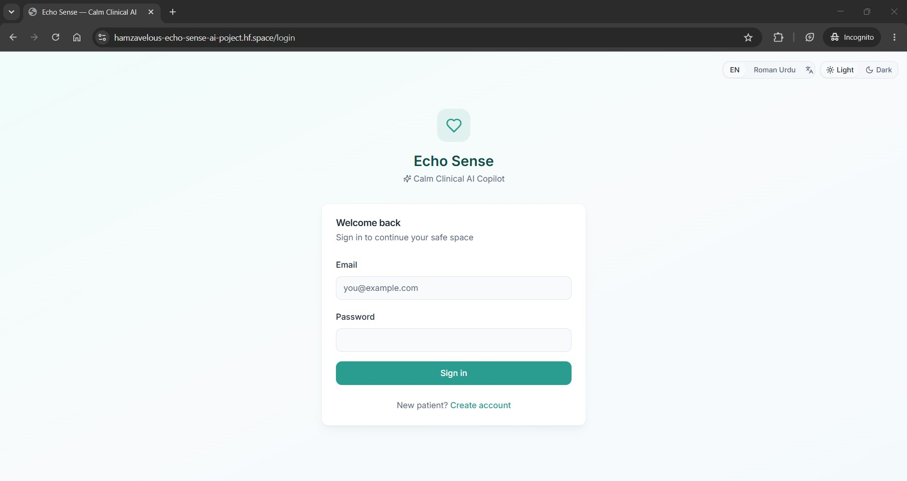

**Patient registration**

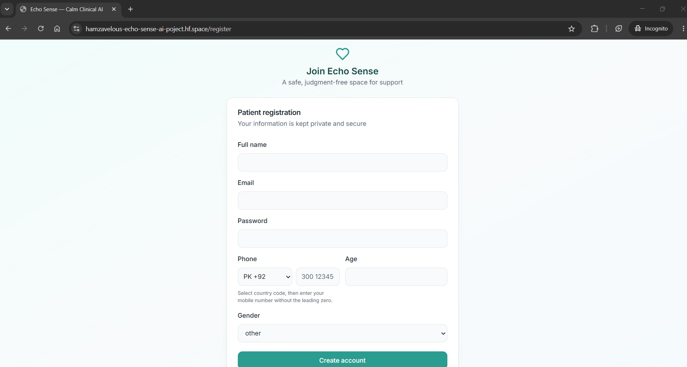

**Dark mode**

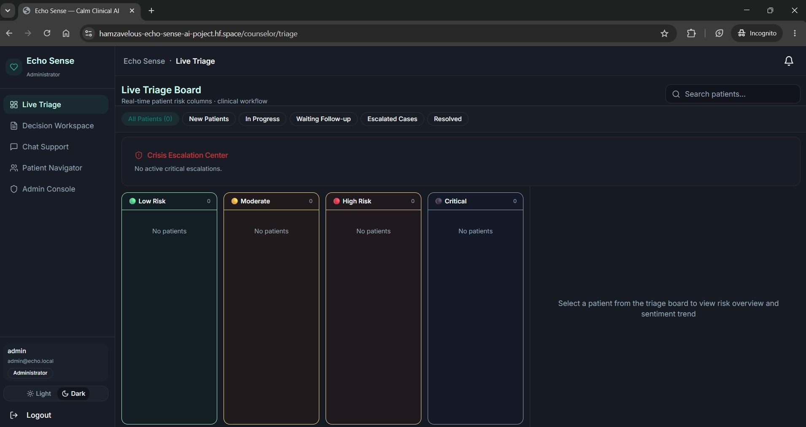

---

### Patient experience

**AI chat dashboard**

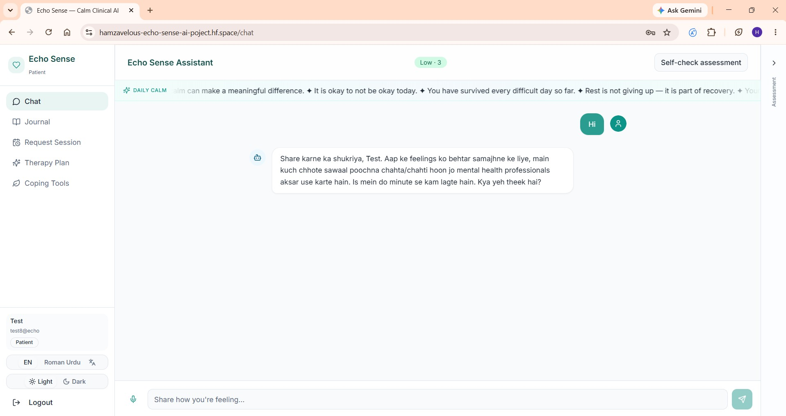

**Journal**

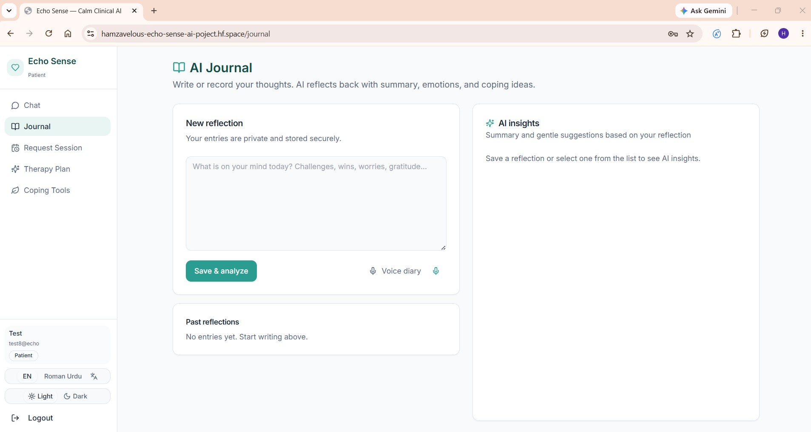

**Request session**

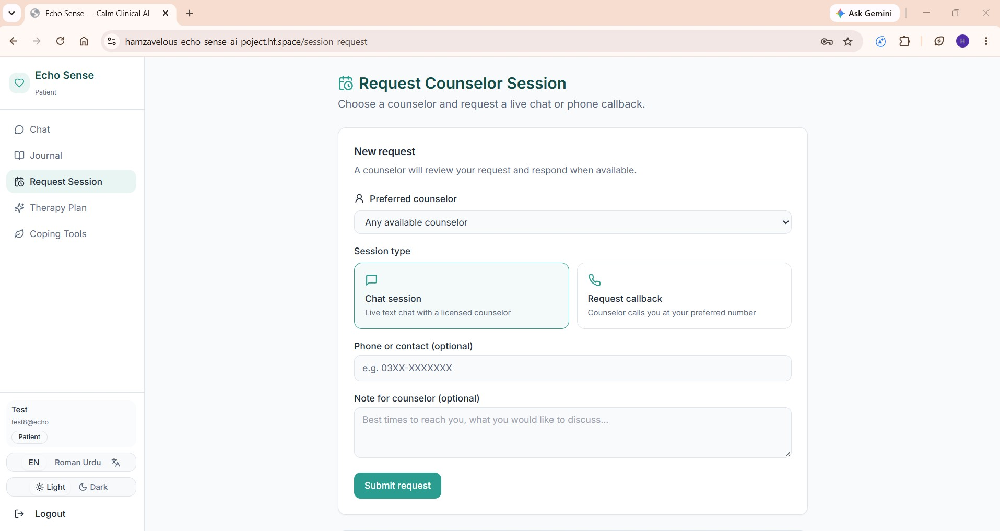

**Coping tools**

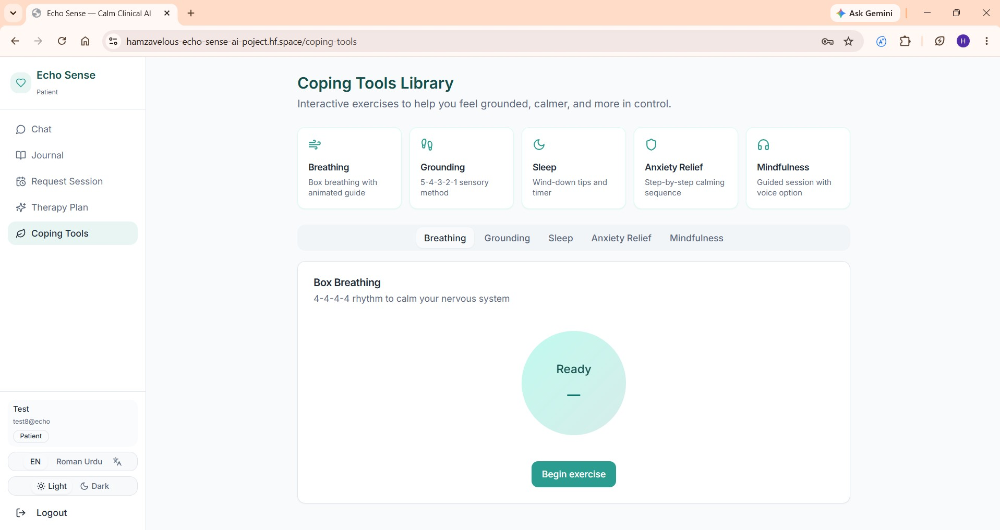

**Therapy plan**

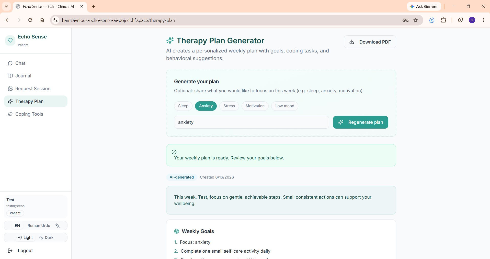

---

### Counselor workspace

**Live triage portal**

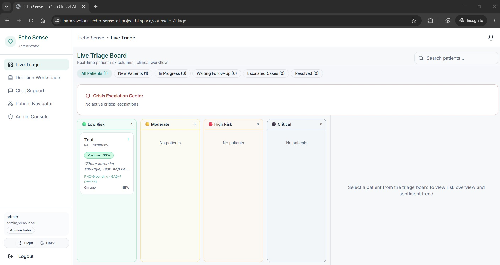

**Decision workspace**

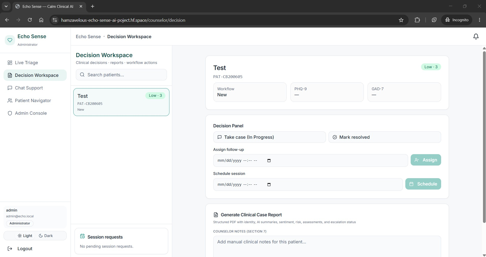

**Chat support**

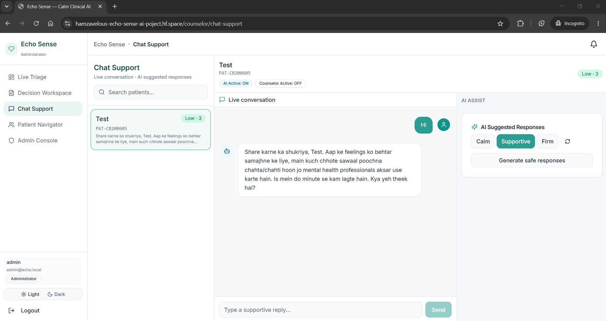

**Patient navigator**

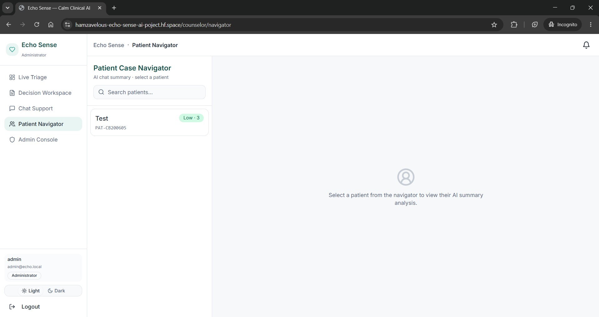

---

### Admin console

**Admin dashboard**

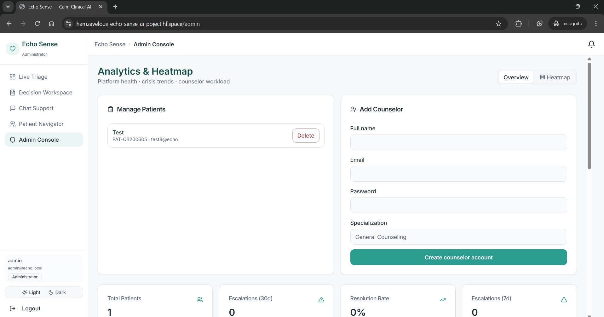

**Admin analytics (continued)**

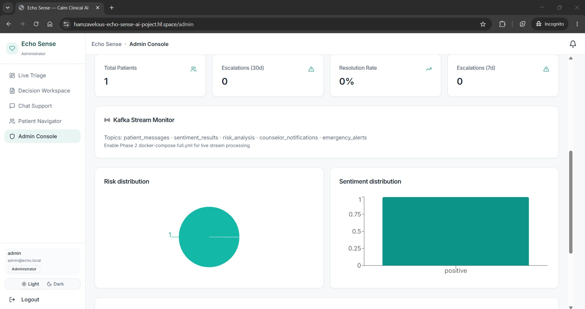

---

## Features

| Area | Capabilities |
|------|----------------|
| **Patients** | AI chat (text + voice), assessments, journal, coping tools, therapy plan, session requests |
| **Counselors** | Live triage, decision workspace, patient navigator, chat support, clinical reports |
| **Admin** | Analytics console, user oversight |
| **AI & safety** | OpenRouter LLM, Deepgram voice, risk scoring, crisis escalation, RAG knowledge base |

---

## Tech stack

- **Frontend:** React, Vite, TypeScript, Tailwind CSS, Framer Motion
- **Backend:** Flask, JWT, SQLAlchemy
- **Database:** PostgreSQL (local) · SQLite (Hugging Face demo)
- **Vector DB:** ChromaDB
- **AI:** OpenRouter, Deepgram, API Ninjas, Hugging Face embeddings

---

## Quick start (local)

### 1. Clone & environment

```bash
git clone https://github.com/Hamzaviour/EchoSense_Mental_Health_Crisis.git
cd EchoSense_Mental_Health_Crisis
cp .env.example .env
```

Edit `.env` with your API keys. **Never commit `.env`.**

### 2. Docker (recommended)

```bash
cd docker
docker compose up --build
```

- Frontend: http://localhost:5173  
- Backend: http://localhost:5000/api/health  
- ChromaDB: http://localhost:8000  

### 3. Manual development

**Backend**

```bash
cd backend
python -m venv .venv
.venv\Scripts\activate          # Windows
# source .venv/bin/activate     # macOS / Linux
pip install -r requirements.txt
python scripts/init_db.py
python run.py
```

API runs on **http://localhost:5001** (see `PORT` in `.env`).

**Frontend**

```bash
cd frontend
npm install
npm run dev
```

App runs on **http://localhost:5173** (proxies `/api` to the backend).

### 4. Accounts

| Role | How to register |
|------|-----------------|
| **Patient** | Login → *Create patient account* → `/register` |
| **Counselor** | Login → *Register as counselor* → `/register/counselor` |
| **Admin** | `python backend/scripts/create_admin.py` → `admin@echo.local` / `admin123` |

---

## API overview

| Endpoint | Description |
|----------|-------------|
| `POST /api/auth/register` | Patient registration |
| `POST /api/auth/register-counselor` | Counselor registration |
| `POST /api/auth/login` | JWT login |
| `GET /api/chat/greeting` | Personalized greeting |
| `POST /api/chat/message` | Chat + RAG + risk |
| `POST /api/chat/voice` | Voice → Deepgram → chat |
| `GET /api/counselor/queue` | Patient queue by risk |
| `POST /api/counselor/copilot` | AI counselor suggestions |
| `GET /api/patient/journal/export/pdf` | Journal PDF export |
| `GET /api/escalations/{id}/pdf` | Crisis escalation PDF |

---

## Hugging Face deployment

Deploy files are in `deploy/hf/`.

```powershell
$env:HF_TOKEN = "hf_your_token_here"
.\deploy\hf\push_to_hf.ps1
```

Add Space secrets at [HF Space settings](https://huggingface.co/spaces/Hamzavelous/echosense-ai/settings): `OPENROUTER_API_KEY`, `DEEPGRAM_API_KEY`, `SECRET_KEY`, `JWT_SECRET_KEY`, then **Factory rebuild**.

---

## Push to GitHub

Remote:

```
https://github.com/Hamzaviour/EchoSense_Mental_Health_Crisis.git
```

```bash
git status
git add .
git commit -m "Your commit message"
git push origin main
```

Use a **Personal Access Token** (not your password) when GitHub prompts for credentials.

**Do not push:** `.env`, `node_modules/`, `.venv/`, `Screenshots/` (local only — README images live in `docs/images/`).

---

## Project structure

```
echo-sense/
├── backend/          # Flask API, models, services
├── frontend/         # React + Vite UI
├── docs/images/      # README screenshots (for GitHub)
├── deploy/hf/        # Hugging Face Docker Space
├── docker/           # docker-compose for local dev
└── .env.example      # Environment template
```

---

## Scripts

```bash
python backend/scripts/verify_external_apis.py
python backend/scripts/ingest_mentalchat16k.py --limit 200 --model minilm
python backend/scripts/generate_project_report_docx.py
python backend/scripts/generate_user_manual_docx.py
```

---

## Authors

- Ch Hamza Younas

---

## Disclaimer

Echo Sense is a decision-support tool. It does **not** replace licensed mental health professionals.

**Crisis helpline (Pakistan):** Umang **0311-7786264**
